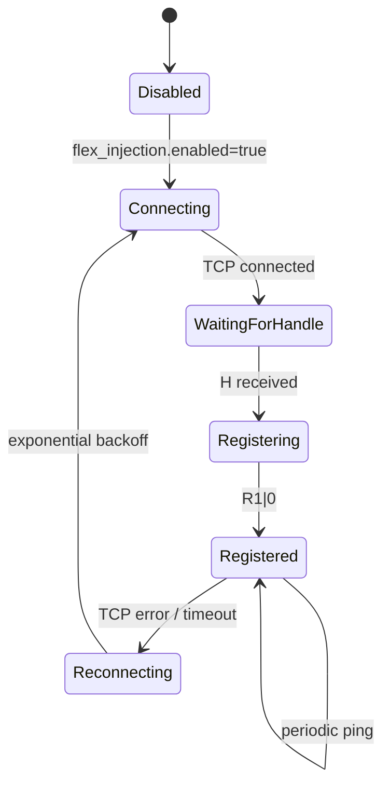

# Flex Amplifier Presence Injection

Status: Phase 17 passive prototype implemented. Presence only; no RF-risk control.

## Research Sources

- [FlexRadio SmartSDR TCP/IP API](https://github-wiki-see.page/m/flexradio/smartsdr-api-docs/wiki/SmartSDR-TCPIP-API): the radio command API uses TCP port `4992`, sends `V...` and `H<handle>` at connect, accepts `C<seq>|command` lines, and returns `R<seq>|<code>|...` responses.
- [FlexRadio TCP/IP `amplifier` command docs](https://github-wiki-see.page/m/flexradio/smartsdr-api-docs/wiki/TCPIP-amplifier): `amplifier create` registers a new amplifier object associated with the creating client handle. `amplifier set <handle> operate=0|1` exists, but EGB does not use it in Phase 17.
- [FlexRadio TCP/IP `sub amplifier all` docs](https://github-wiki-see.page/m/flexradio/smartsdr-api-docs/wiki/TCPIP-sub): GUI clients subscribe to amplifier status for all registered amplifiers.
- [FlexRadio PGXL API document](https://edge.flexradio.com/www/offload/20240326085158/PGXL-Amplifier-to-Radio-API-Documentation.pdf): a paired PGXL discovers a radio, connects as a non-GUI client, parses initial radio state, then registers itself using the FLEX Amplifier API.
- AetherSDR source: `RadioModel::onStatusReceived` treats `amplifier <handle> model=<non-empty non-TunerGeniusXL>` as power-amplifier presence and emits `amplifierChanged(true)`, which shows the PA/AMP applet.

## Mechanism

EGB now has an optional Flex API registration client:

```text
EGB -> Flex radio TCP API :4992
  receive V...
  receive H<client-handle>
  send C1|amplifier create ip=<egb-ip> port=9008 model=PowerGeniusXL serial_num=EGB-KPA500 ant=ANT1:PORTA,ANT2:NONE
  receive R1|0...
```

The radio owns the actual amplifier object handle. The configured `flex_injection.handle` is only a stable EGB label for logs and future config. It is not sent as a Flex object handle because the radio assigns handles.

When AetherSDR is connected to the same radio and has executed `sub amplifier all`, it should receive the radio-originated amplifier status record and run its normal PA applet creation path. AetherSDR should then auto-connect its PGXL direct TCP client to the `ip` and `port` advertised by EGB.

## Lifecycle



The prototype reconnects with exponential backoff. It preserves PGXL/TGXL direct sockets and serial polling; loss of Flex injection should not stop the bridge.

## Configuration

```yaml
flex_injection:
  enabled: true
  radio_ip: 192.168.1.100
  radio_port: 4992
  amplifier_ip: 192.168.1.50
  amplifier_port: 9008
  amplifier_model: PowerGeniusXL
  serial: EGB-KPA500
  handle: amp_1
  ant_map: ANT1:PORTA,ANT2:NONE
  reconnect_initial_ms: 1000
  reconnect_max_ms: 30000
  ping_interval_ms: 30000
```

Validation rejects public IPs for both `radio_ip` and `amplifier_ip`. Phase 17 is LAN/local only.

## Telemetry Mapping

Presence registration advertises the PGXL-compatible direct TCP endpoint:

```text
ip=<flex_injection.amplifier_ip>
port=<flex_injection.amplifier_port>
model=PowerGeniusXL
serial_num=<flex_injection.serial>
ant=<flex_injection.ant_map>
```

Actual panel telemetry still comes from the existing PGXL direct socket on port `9008`, backed by shared KPA500 state:

| AetherSDR field | EGB source |
| --- | --- |
| `state` | KPA500 operate/standby poll mapped to PGXL state |
| `peakfwd` | KPA500 forward power |
| `swr` | KPA500 SWR mapped to PGXL return-loss convention |
| `temp` | KPA500 temperature |
| `id` | KPA500 current when available |
| `vac` | `0` until safe AC mains equivalent is validated |
| `meffa` | safe compatibility placeholder |

Phase 17 does not create Flex meters or UDP VITA meter streams. If AetherSDR requires radio-side meters in addition to direct PGXL telemetry, that will be a later correction loop.

## Control Policy

Phase 17 sends no RF-risk commands.

Not implemented:

- `amplifier set <handle> operate=1`
- `amplifier set <handle> operate=0`
- meter creation
- interlock creation
- proxy command interception
- WAN exposure

KPA500 standby remains available only through existing explicit local CLI safety gates, not through Flex injection.

## Expected AetherSDR Behavior

With `config.flex-injection-readonly.yaml` adjusted for the real radio IP and Windows bridge LAN IP:

1. EGB connects to the Flex radio API.
2. EGB logs `Flex API client handle received`.
3. EGB logs `Flex amplifier object creation sent`.
4. If the radio accepts registration, EGB logs `Flex amplifier object creation accepted`.
5. AetherSDR should receive a radio-side amplifier presence record.
6. The PA/AMP applet should become visible.
7. AetherSDR should connect its PGXL direct socket to EGB at port `9008`.

If PA still does not appear, capture the Flex TCP stream and verify whether the radio broadcast an `amplifier <handle> model=PowerGeniusXL ...` status to AetherSDR after registration.

## Compatibility Notes

Stock AetherSDR:

- Expected to work because it already uses the Flex radio amplifier status path for PA applet creation.

SmartSDR for Mac:

- Unknown. If it follows the same Flex API amplifier subscription path, the registration approach should be more compatible than a client-specific proxy.

SmartLink/WAN:

- Not ready. The registration client must reach the radio TCP API from the Windows bridge host. Exposing Flex API or PGXL/TGXL ports publicly remains unsafe.

Future proxy mode:

- Still possible, but Phase 17 avoids it. Direct registration is simpler and closer to how a real PGXL integrates with a Flex radio.
