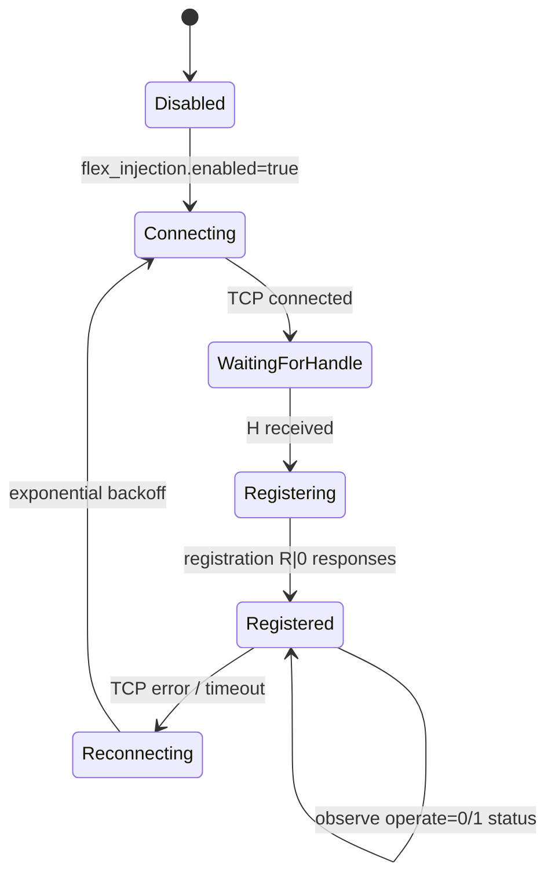

# Flex Amplifier Presence Injection

Status: Phase 19 full PGXL radio-side registration prototype implemented. RF-risk operate remains gated.

## Research Sources

- [FlexRadio SmartSDR TCP/IP API](https://github-wiki-see.page/m/flexradio/smartsdr-api-docs/wiki/SmartSDR-TCPIP-API): the radio command API uses TCP port `4992`, sends `V...` and `H<handle>` at connect, accepts `C<seq>|command` lines, and returns `R<seq>|<code>|...` responses.
- [FlexRadio TCP/IP `amplifier` command docs](https://github-wiki-see.page/m/flexradio/smartsdr-api-docs/wiki/TCPIP-amplifier): `amplifier create` registers a new amplifier object associated with the creating client handle. `amplifier set <handle> operate=0|1` exists, but EGB does not use it in Phase 17.
- [FlexRadio TCP/IP `sub amplifier all` docs](https://github-wiki-see.page/m/flexradio/smartsdr-api-docs/wiki/TCPIP-sub): GUI clients subscribe to amplifier status for all registered amplifiers.
- [FlexRadio PGXL API document](https://edge.flexradio.com/www/offload/20240326085158/PGXL-Amplifier-to-Radio-API-Documentation.pdf): a paired PGXL discovers a radio, connects as a non-GUI client, parses initial radio state, then registers itself using the FLEX Amplifier API.
- AetherSDR source: `RadioModel::onStatusReceived` treats `amplifier <handle> model=<non-empty non-TunerGeniusXL>` as power-amplifier presence and emits `amplifierChanged(true)`, which shows the PA/AMP applet.

## Mechanism

EGB now has an optional Flex API registration client. Phase 19 sends the broader PGXL registration sequence described by the FlexRadio PGXL Amplifier-to-Radio API:

```text
EGB -> Flex radio TCP API :4992
  receive V...
  receive H<client-handle>
  send C1|amplifier create ip=<egb-ip> port=9008 model=PowerGeniusXL serial_num=EGB-KPA500 ant=ANT1:PORTA,ANT2:PORTB
  send C2|meter create name=FWD type=AMP min=30.0 max=63.01 units=DBM
  send C3|meter create name=RL type=AMP min=34.0 max=60.0 units=DB
  send C4|meter create name=DRV type=AMP min=10.0 max=50.00 units=DBM
  send C5|meter create name=ID type=AMP min=0.0 max=70.0 units=AMPS
  send C6|meter create name=TEMP type=AMP min=0.0 max=100.0 units=TEMP_C
  send C7|interlock create type=AMP valid_antennas=ANT1,ANT2 name=PG-XL serial=EGB-KPA500
  send C8|keepalive enable
  send C9|sub amplifier all
  send periodic Cn|ping
```

The radio owns the actual amplifier object handle. The configured `flex_injection.handle` is only a stable EGB label for logs and future config. It is not sent as a Flex object handle because the radio assigns handles.

When AetherSDR is connected to the same radio and has executed `sub amplifier all`, it should receive the radio-originated amplifier status record and run its normal PA applet creation path. AetherSDR should then auto-connect its PGXL direct TCP client to the `ip` and `port` advertised by EGB.

## Lifecycle



The prototype reconnects with exponential backoff. It preserves PGXL/TGXL direct sockets and serial polling; loss of Flex injection should not stop the bridge.

## Configuration

```yaml
flex_injection:
  enabled: true
  radio_ip: 192.168.1.100
  radio_port: 4992
  amplifier_ip: 192.168.1.50
  amplifier_port: 9008
  amplifier_model: PowerGeniusXL
  serial: EGB-KPA500
  handle: amp_1
  ant_map: ANT1:PORTA,ANT2:PORTB
  full_pgxl_registration: true
  create_meters: true
  create_interlock: true
  reconnect_initial_ms: 1000
  reconnect_max_ms: 30000
  ping_interval_ms: 30000
```

Validation rejects public IPs for both `radio_ip` and `amplifier_ip`. Phase 17 is LAN/local only.

## Registration And Handle Tracking

EGB logs every `R<seq>|...` response for amplifier, meter, interlock, keepalive, subscription, and ping commands. The `/status` endpoint exposes:

- Flex injection connection state.
- Radio client handle.
- Created amplifier handle if returned directly or later observed in radio status.
- Meter handles when the radio returns a non-empty meter-create response body.
- Interlock handle when the radio returns one.
- Last command/response and success/failure counters.

If the radio returns an empty response body but later broadcasts an `amplifier <handle> ...` status, EGB records the handle from that status.

## Telemetry Mapping

Presence registration advertises the PGXL-compatible direct TCP endpoint:

```text
ip=<flex_injection.amplifier_ip>
port=<flex_injection.amplifier_port>
model=PowerGeniusXL
serial_num=<flex_injection.serial>
ant=<flex_injection.ant_map>
```

Actual panel telemetry still comes from the existing PGXL direct socket on port `9008`, backed by shared KPA500 state:

| AetherSDR field | EGB source |
| --- | --- |
| `state` | KPA500 operate/standby poll mapped to PGXL state |
| `peakfwd` | KPA500 forward power |
| `swr` | KPA500 SWR mapped to PGXL return-loss convention |
| `temp` | KPA500 temperature |
| `id` | KPA500 current when available |
| `vac` | `0` until safe AC mains equivalent is validated |
| `meffa` | safe compatibility placeholder |

Phase 19 creates the documented AMP meter objects. It does not yet publish live meter values through the Flex metering stream. The PGXL API document points to the SmartSDR metering protocol for the meter process, but the exact external-amplifier value publication path has not yet been validated in captures. Until that is known, the authoritative live values remain the PGXL direct socket backed by KPA500 polling.

## Control Policy

Phase 18 observes the Flex radio amplifier status after AetherSDR sends:

```text
amplifier set <handle> operate=0|1
```

That exact command comes from `MainWindow.cpp` in the inspected AetherSDR source when the AMP applet operate button is pressed.

EGB subscribes to `sub amplifier all`, watches status for the registered amplifier object, and maps:

- `operate=0` or standby-like state to desired KPA500 standby `^OS0;`.
- `operate=1` or operate/transmit-like state to desired KPA500 operate `^OS1;`, only when RF-risk is explicitly allowed.

If RF-risk is disabled and the radio reports `operate=1`, EGB sends a radio-side revert:

```text
amplifier set <handle> operate=0
```

and does not send `^OS1;`.

Not implemented:

- live radio-side meter value publication
- proxy command interception
- WAN exposure

KPA500 standby is state-change-safe but still blocked when `kpa500.dry_run: true`. KPA500 operate requires `kpa500.allow_rf_risk: true` or the explicit `test-kpa-operate --allow-rf-risk` CLI path.

## Expected AetherSDR Behavior

With `config.flex-injection-readonly.yaml` adjusted for the real radio IP and Windows bridge LAN IP:

1. EGB connects to the Flex radio API.
2. EGB logs `Flex API client handle received`.
3. EGB logs all PGXL registration commands, including amplifier, meter, interlock, keepalive, and subscription.
4. If the radio accepts registration, EGB logs `Flex PGXL registration command accepted` for each command.
5. AetherSDR should receive a radio-side amplifier presence record.
6. The PA/AMP applet should become visible.
7. AetherSDR should connect its PGXL direct socket to EGB at port `9008`.

If PA still does not appear in SmartSDR, capture the Flex TCP stream and verify whether the radio accepted the meter/interlock creation commands and broadcast an `amplifier <handle> model=PowerGeniusXL ...` status with non-empty amplifier identity.

## Compatibility Notes

Stock AetherSDR:

- Expected to work because it already uses the Flex radio amplifier status path for PA applet creation.

SmartSDR for Mac:

- Unknown. If it follows the same Flex API amplifier subscription path, the registration approach should be more compatible than a client-specific proxy.

SmartLink/WAN:

- Not ready. The registration client must reach the radio TCP API from the Windows bridge host. Exposing Flex API or PGXL/TGXL ports publicly remains unsafe.

Future proxy mode:

- Still possible, but Phase 17 avoids it. Direct registration is simpler and closer to how a real PGXL integrates with a Flex radio.
