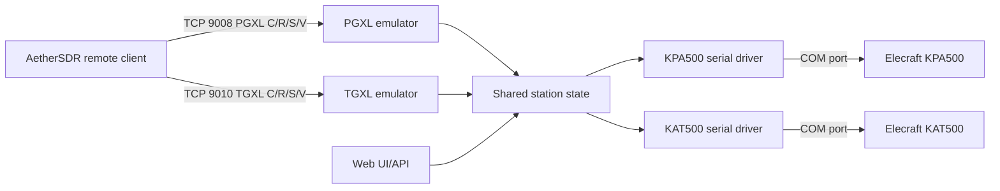
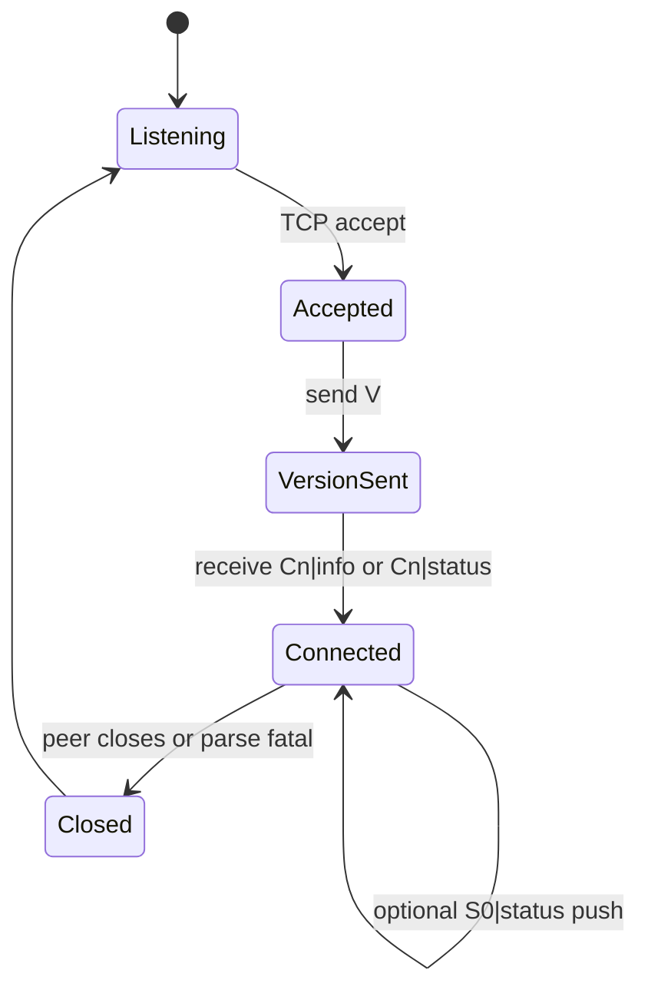
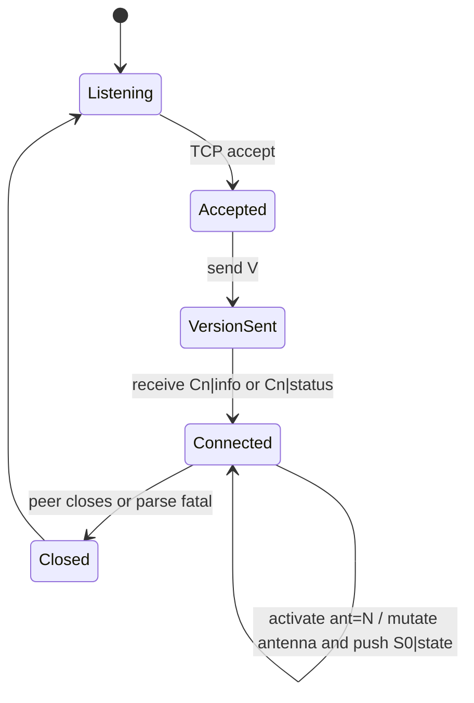

# Elecraft Genius Bridge Architecture

Status: Phase 1 architecture, protocol source-inspected only.

## Target Shape



## Separation Rules

The bridge should keep four responsibilities separate:

1. Network emulation: PGXL/TGXL TCP protocol sessions.
2. Shared state: normalized amp/tuner/radio state.
3. Hardware adapters: Elecraft KPA500/KAT500 serial command polling and control.
4. Operator surfaces: configuration, logs, diagnostics, and web UI.

The emulator layer must not know Elecraft serial command details. It should read and mutate normalized state through command intents such as `SetAmpOperate`, `RequestTune`, `SetTunerBypass`, or `SelectAntenna`.

## MVP Network Surface

```text
0.0.0.0:9008  PGXL TCP emulator
0.0.0.0:9010  TGXL TCP emulator
127.0.0.1 or configured bind  Web UI/API, later phase
```

Manual IP entry in AetherSDR is sufficient for Phase 2. Discovery can be deferred.

## PGXL Session State Machine



Polling expected from AetherSDR: every `200 ms`.

## TGXL Session State Machine



Polling expected from AetherSDR: every `1000 ms`.

## Shared State Draft

```rust
pub struct SharedState {
    pub frequency_hz: u64,
    pub band: Band,
    pub amp: AmpState,
    pub tuner: TunerState,
    pub clients: ClientState,
}

pub struct AmpState {
    pub present: bool,
    pub operate: bool,
    pub state: AmpOperatingState,
    pub forward_power_w: f32,
    pub swr: f32,
    pub drain_current_a: f32,
    pub mains_v: u16,
    pub temp_c: f32,
    pub meffa: String,
    pub fault: Option<String>,
}

pub struct TunerState {
    pub present: bool,
    pub operate: bool,
    pub bypass: bool,
    pub tuning: bool,
    pub relay_c1: i32,
    pub relay_l: i32,
    pub relay_c2: i32,
    pub antenna_a: Option<u8>,
    pub forward_power_w: f32,
    pub swr: f32,
}
```

This is not production code; it is the target shape for later implementation.

## Security Boundary

Because AetherSDR currently expects native PGXL/TGXL TCP without an observed authentication exchange, token authentication cannot be inserted into the raw PGXL/TGXL wire protocol without risking compatibility.

Recommended security model:

- Default bind should be LAN-only during development.
- WAN exposure should be explicit.
- Add token authentication to web UI/API.
- For raw PGXL/TGXL ports, use firewall allowlists, reverse proxy/tunnel policy, or optional TLS wrapping only after client compatibility is proven.
- Rate-limit connections and commands at the bridge listener.

## Open Protocol Questions

These require packet capture or real-device validation:

- Exact `info` response body for PGXL.
- Exact `info` response body for TGXL.
- Exact error codes for unknown or invalid commands.
- Whether PGXL supports native direct TCP operate/standby commands.
- Exact state strings emitted by PGXL firmware versions.
- Exact TGXL tune lifecycle messages during a real autotune.
- Whether SmartSDR for macOS requires fields beyond AetherSDR's current subset.
- Whether Maestro discovers or controls PGXL/TGXL directly or only through a Flex radio.

