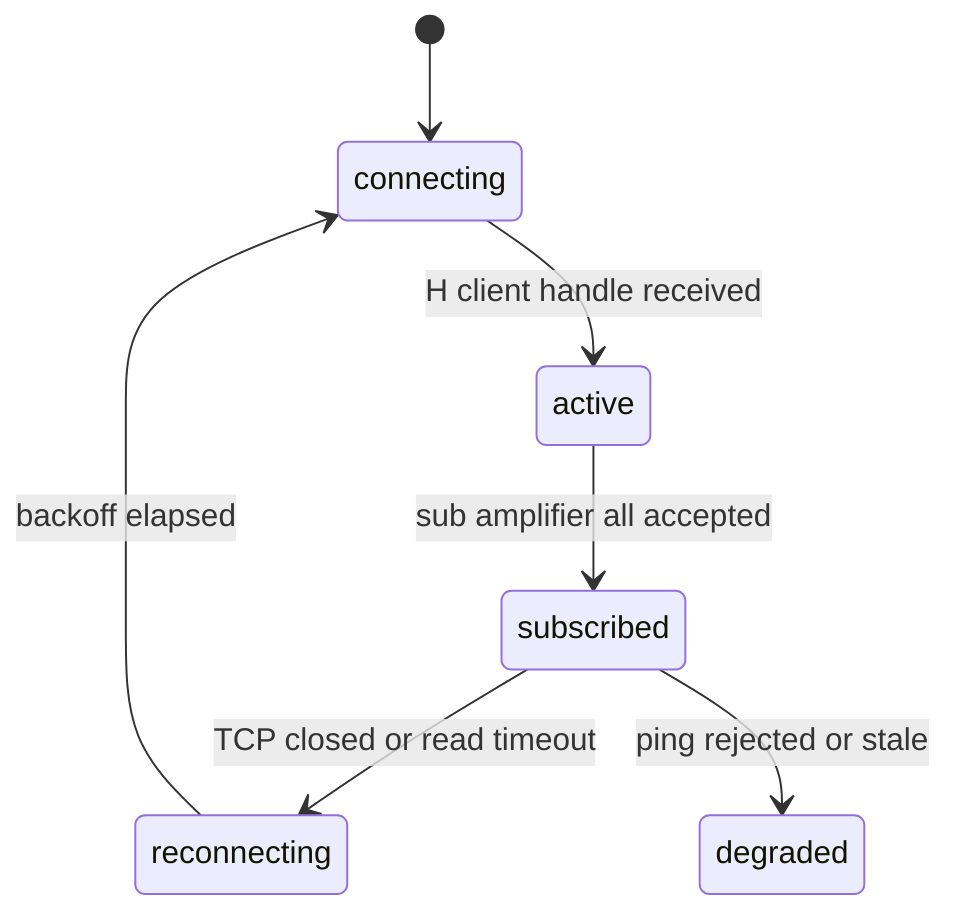

# Flex Lifecycle State Machine

Phase 46 makes lifecycle state explicit so PGXL/TGXL instability can be diagnosed from `/status` and evidence bundles instead of inferred from disconnected counters.

## Shared States

All lifecycle objects use the same core states:

- `not-started`: subsystem has not begun.
- `disconnected`: no active transport/session exists.
- `connecting`: socket/task is attempting to connect.
- `subscribed`: Flex subscriptions were sent or accepted.
- `object-created`: EGB is sending a Flex object registration sequence.
- `object-advertised`: create/register commands have been sent.
- `object-accepted`: Flex accepted the create/register command.
- `tcp-connected`: direct PGXL/TGXL TCP client is connected.
- `active`: object/session has a stable handle or active client.
- `degraded`: subsystem exists but is missing an expected dependency.
- `removed`: Flex explicitly reported an object removal.
- `reconnecting`: session ended and backoff/reconnect is pending.

## FlexSessionState



Rules:

- The Flex TCP session is long-lived.
- `amplifier create`, meter create, interlock create, `keepalive enable`, `sub amplifier all`, `sub slice all`, and `sub tx all` are sent once per Flex TCP session.
- Duplicate create/subscription attempts are counted and written to `lifecycle-events.jsonl`.

## AmplifierLifecycleState

```mermaid
stateDiagram-v2
    [*] --> object-created: registration begins
    object-created --> object-advertised: amplifier create sent
    object-advertised --> object-accepted: Rn|0 response
    object-accepted --> active: amplifier handle/status observed
    active --> removed: S...|amplifier <handle> removed
    active --> degraded: Flex session ended
    removed --> reconnecting: Flex reconnect required
```

Rules:

- The amplifier handle is preserved until the Flex session ends or Flex reports removal.
- Polling changes, PGXL TCP reconnects, or telemetry updates must not recreate the amplifier.
- Any `removed` event captures the previous advertised state, PGXL TCP state, last Flex command/response, and counts in `amplifier-removal-timeline.md`.

## PGXLLifecycleState

```mermaid
stateDiagram-v2
    [*] --> not-started
    not-started --> object-advertised: Flex amp registration started
    object-advertised --> tcp-connected: AetherSDR opens TCP 9008
    tcp-connected --> active: status polling stable
    active --> degraded: TCP closes or protocol errors appear
```

Rules:

- PGXL direct status remains authoritative to the real KPA500 state.
- Flex connect-assist is a UI connection workaround only and must not switch the KPA500 to operate.

## TGXLLifecycleState

```mermaid
stateDiagram-v2
    [*] --> tcp-connected: AetherSDR opens TCP 9010
    tcp-connected --> active: status polling stable
    active --> degraded: TCP closes or parser errors appear
```

Frequency and band changes are event-driven from Flex slice/TX status into the TGXL advertised status.

## TuneLifecycleState

```mermaid
stateDiagram-v2
    [*] --> idle
    idle --> tune-requested: TGXL autotune received
    tune-requested --> tuning: KAT500 T; accepted for execution
    tuning --> tune-complete: TP;/VSWR; follow-up completed
    tuning --> tune-failed: serial/control error
    tune-requested --> cooldown: duplicate request suppressed
    tune-complete --> idle: lifecycle reset
```

Duplicate tune suppression is time-limited. It must never permanently suppress future Tune commands.

